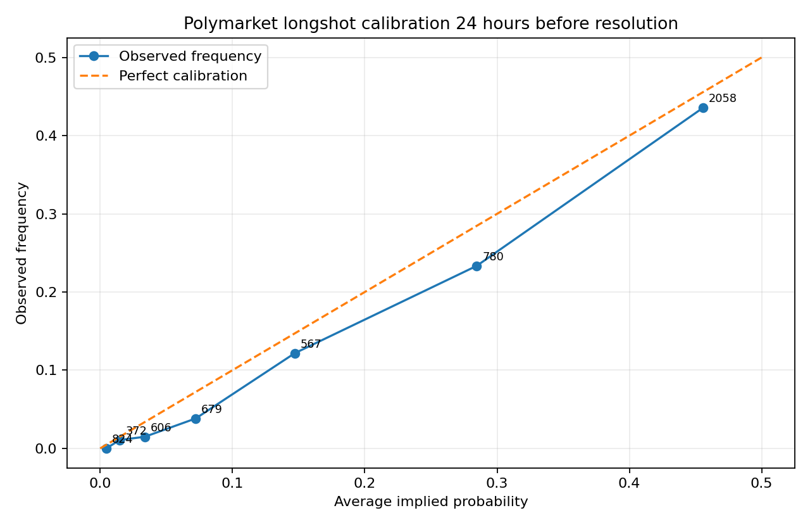
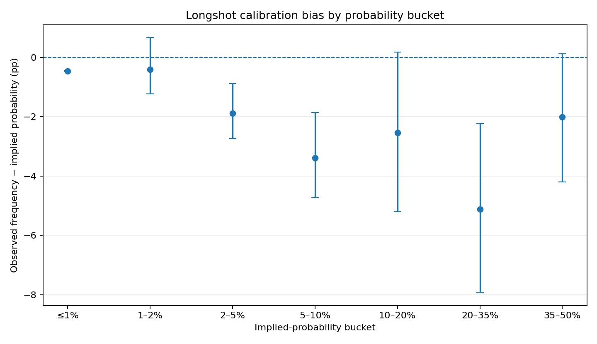
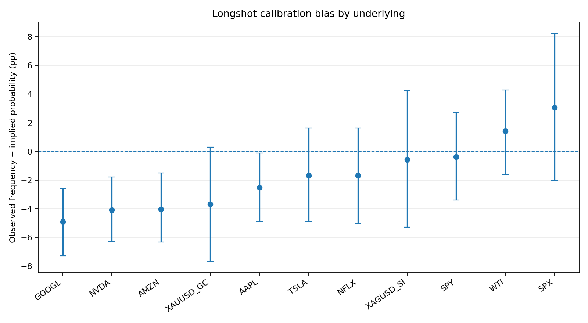

# Polymarket Financial Market Calibration

Empirical calibration study of resolved Polymarket financial markets, focused on whether lower-probability outcomes are systematically overpriced before resolution.

## Research question

If a binary outcome trades at 10%, does it actually occur about 10% of the time?

The analysis uses one observation per market: the **lower-priced outcome 24 hours before resolution**. This avoids mechanically counting both complementary sides of the same binary market as separate observations.

## Dataset

The included `data/05_snapshot_table.csv` was generated from public Polymarket Gamma and CLOB endpoints. It contains **35,594 token snapshots across 6,454 resolved financial markets** and several pre-resolution horizons.

For the main 24-hour analysis, the notebook retains **5,886 unique markets** covering 11 financial underlyings:

`SPY`, `SPX`, `AAPL`, `AMZN`, `GOOGL`, `NVDA`, `TSLA`, `NFLX`, `WTI`, `Gold`, and `Silver`.

The 24-hour sample spans approximately **January 2025 to May 2026**.

## Main result

Across the 5,886-market 24-hour sample, the lower-priced outcome had:

- average implied probability: **22.45%**
- observed frequency: **20.15%**
- average calibration error (`observed − implied`): **−2.30 percentage points**

A negative calibration error means that, in this sample, the lower-probability outcome occurred less often than its market price implied.

| Implied-probability bucket | Markets | Avg. implied | Observed | Calibration error |
|---|---:|---:|---:|---:|
| ≤1% | 824 | 0.46% | 0.00% | −0.46 pp |
| 1–2% | 372 | 1.48% | 1.08% | −0.41 pp |
| 2–5% | 606 | 3.37% | 1.49% | −1.88 pp |
| 5–10% | 679 | 7.22% | 3.83% | −3.39 pp |
| 10–20% | 567 | 14.70% | 12.17% | −2.53 pp |
| 20–35% | 780 | 28.45% | 23.33% | −5.12 pp |
| 35–50% | 2,058 | 45.55% | 43.54% | −2.01 pp |

These results are descriptive evidence of a longshot-style calibration pattern in the selected sample, not proof of an exploitable trading strategy.

## Results

### Calibration curve



Numbers next to the points indicate the number of markets in each probability bucket.

### Calibration bias by probability bucket



Error bars are 95% bootstrap intervals computed across markets.

### Calibration bias by underlying



The effect is not uniform across underlyings, which is one reason the aggregate result should not be interpreted as a universal market inefficiency.

## Methodology

The original data-generation pipeline:

1. discovers closed Polymarket markets linked to selected financial underlyings;
2. filters semantic false positives and non-price markets;
3. infers resolved binary outcomes from final outcome prices;
4. downloads public CLOB price histories;
5. extracts the nearest price before several pre-resolution horizons;
6. removes stale observations and binary pairs whose token prices are not approximately complementary;
7. computes calibration error, Brier score, and log loss.

The notebook in this repository then simplifies the analysis to the 24-hour horizon and keeps only the lower-priced side of each market.

## Repository structure

```text
.
├── README.md
├── requirements.txt
├── .gitignore
├── data/
│   ├── README.md
│   └── 05_snapshot_table.csv
├── notebook/
│   └── polymarket_calibration_analysis.ipynb
└── results/
    ├── calibration_curve_1d.png
    ├── bias_by_probability_bucket_1d.png
    ├── bias_by_underlying_1d.png
    ├── summary_by_probability_bucket_1d.csv
    └── summary_by_underlying_1d.csv
```

## Run the analysis

```bash
pip install -r requirements.txt
jupyter notebook notebook/polymarket_calibration_analysis.ipynb
```

The notebook reads the included `05_snapshot_table.csv`; no API key, wallet, or Polymarket credentials are required.

## Limitations

- The market universe is identified using text-based rules for selected financial underlyings.
- The study uses the nearest available price before the 24-hour target rather than a guaranteed trade at exactly that timestamp.
- Results do not account for bid-ask spreads, fees, market impact, or execution constraints.
- Markets may share common information or event structure, so observations are not necessarily economically independent.
- The analysis is descriptive and does not establish that the observed calibration pattern is stable out of sample.

## Technologies

Python, pandas, NumPy, Matplotlib, Jupyter.
